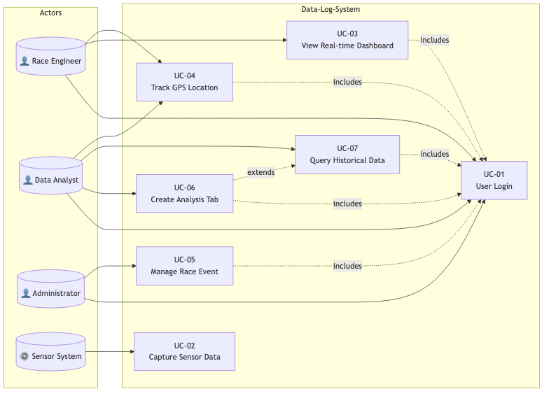

# Data-Log-System

Telemetry Data Logging System for Regterschot Racing Team

## Project Overview

This project provides a complete telemetry data logging and visualization platform for the Regterschot Racing Team. The system captures real-time sensor data from a racing vehicle via CAN bus, stores it in a database, and provides web-based visualization for race engineers and data analysts.

## System Architecture

```
Sensors --> Arduino/ESP32 --> CAN Bus --> Raspberry Pi --> MySQL --> Dashboard
                                              |
                                              v
                                         MQTT Broker --> Real-time Updates
```

### Components

| Layer | Technology | Description |
|-------|------------|-------------|
| **Acquisition** | Arduino, MCP2515 | Reads sensors, transmits CAN frames |
| **Processing** | Raspberry Pi, Python | Receives CAN data, stores to database |
| **Storage** | MySQL | Persistent telemetry data storage |
| **Messaging** | MQTT | Real-time data distribution |
| **Frontend** | Angular 15+, PHP | Dashboard and data visualization |

## Project Structure

```
Data-Log-System/
├── 22-23/                      # 2022-2023 Academic Year
│   ├── S1/                     # Semester 1 - Embedded/Hardware
│   │   ├── mqtt_pub/           # MQTT Publisher (C++)
│   │   ├── mqtt_sub/           # MQTT Subscriber (C++)
│   │   ├── rasp-pi-main-code/  # Raspberry Pi main implementation
│   │   └── node-red/           # Node-RED flow definitions
│   │
│   ├── S2/                     # Semester 2 - Full Stack
│   │   ├── 2-frontend-dev/     # PHP/JavaScript Frontend
│   │   ├── 3-rpi-can-datalogger/  # Python CAN Data Logger
│   │   └── 4-can-transmission/ # Arduino CAN + PCB Design
│   │
│   └── IT/                     # IT Phase - Dashboard
│       └── RegterschotDashboard/  # Angular Dashboard
│
├── 23-24/                      # 2023-2024 Academic Year
│
└── docs/                       # Project Documentation
    ├── REQUIREMENTS.pdf        # FURPS+ & MoSCoW Requirements
    ├── USE_CASES.pdf           # Fully Dressed Use Cases
    ├── TECHNICAL_DESIGN.pdf    # UML Diagrams & Architecture
    └── diagrams/               # PNG diagram files
```

## Documentation

| Document | Description |
|----------|-------------|
| [Requirements Specification](docs/REQUIREMENTS.pdf) | FURPS+ requirements with MoSCoW prioritization |
| [Use Case Specification](docs/USE_CASES.pdf) | 7 fully dressed use cases with diagrams |
| [Technical Design](docs/TECHNICAL_DESIGN.pdf) | Class, Sequence, State diagrams + architecture |

## Features

- **Real-time Data Capture**: CAN bus sensor data at 500 KBPS
- **Sensor Support**: Pressure, temperature, wheel speed sensors
- **GPS Tracking**: Vehicle location tracking and history
- **Dashboard**: Web-based real-time visualization
- **Event Management**: Start/stop race event recording
- **Historical Analysis**: Query and export past race data
- **Custom Tabs**: User-defined data visualization layouts

## Technology Stack

| Category | Technologies |
|----------|-------------|
| **Frontend** | Angular 15+, TypeScript, Material Design, PHP |
| **Backend** | Python 3, asyncio, mysql-connector |
| **Embedded** | Arduino, C++, MCP2515 CAN controller |
| **Database** | MySQL 8 |
| **Messaging** | MQTT 3.1.1 |
| **Hardware** | Raspberry Pi 4, ESP32 |

## Getting Started

### Prerequisites

- Node.js 18+ (for Angular dashboard)
- Python 3.8+ (for data logger)
- MySQL 8.x
- Arduino IDE (for sensor firmware)
- Raspberry Pi OS

### Angular Dashboard

```bash
cd 22-23/IT/RegterschotDashboard
npm install
ng serve
```

Access at `http://localhost:4200`

### Python Data Logger

```bash
cd 22-23/S2/3-rpi-can-datalogger
pip install -r requirements.txt
python app/app.py
```

### Arduino Firmware

1. Open `22-23/S2/4-can-transmission/software/can-code/Arduino_main_code.ino`
2. Install MCP2515 library
3. Upload to Arduino

## UML Diagrams

### Class Diagram


### Sequence Diagram


### State Diagram


### Use Case Diagram


## Testing

Angular unit tests:
```bash
cd 22-23/IT/RegterschotDashboard
ng test
```

## Authors

- Regterschot Racing Team
- HAN University of Applied Sciences (2022-2024)

## License

This project is developed for academic purposes at HAN University.
