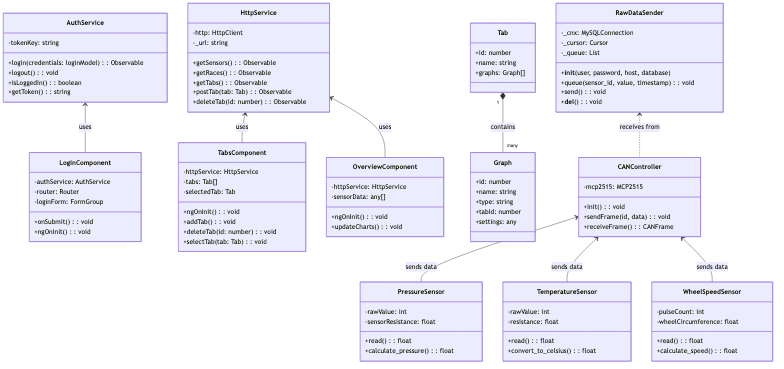
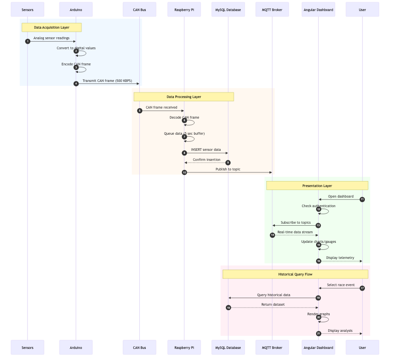

# Technical Design Document
## Data-Log-System - Regterschot Racing

**Version:** 1.0
**Date:** January 2026

---

## 1. System Architecture Overview

The Data-Log-System follows a layered architecture with clear separation of concerns:

```
+-------------------------------------------------------------+
|                    PRESENTATION LAYER                        |
|  +------------------+  +------------------+                  |
|  | Angular Dashboard|  |   PHP Frontend   |                  |
|  |   (TypeScript)   |  |   (Legacy UI)    |                  |
|  +--------+---------+  +--------+---------+                  |
+-----------|--------------------|-----------------------------+
            |                    |
            v                    v
+-------------------------------------------------------------+
|                    COMMUNICATION LAYER                       |
|  +------------------+  +------------------+                  |
|  |   MQTT Broker    |  |    REST API      |                  |
|  |   (Real-time)    |  |   (HTTP/JSON)    |                  |
|  +--------+---------+  +--------+---------+                  |
+-----------|--------------------|-----------------------------+
            |                    |
            v                    v
+-------------------------------------------------------------+
|                    DATA LAYER                                |
|  +---------------------------------------------+            |
|  |           MySQL Database                     |            |
|  |    (Telemetry, Users, Events)               |            |
|  +----------------------+----------------------+            |
+-------------------------|-----------------------------------+
                          |
                          ^
+-------------------------|-----------------------------------+
|                    PROCESSING LAYER                          |
|  +---------------------------------------------+            |
|  |         Raspberry Pi (Python)               |            |
|  |    Linux-CAN-Data-Logger Service            |            |
|  +----------------------+----------------------+            |
+-------------------------|-----------------------------------+
                          |
                          ^
+-------------------------|-----------------------------------+
|                    ACQUISITION LAYER                         |
|  +------------------+  +------------------+                  |
|  | CAN Bus (MCP2515)|  |   GPS Module     |                  |
|  +--------+---------+  +------------------+                  |
|           |                                                  |
|  +--------+--------+                                         |
|  | Arduino/ESP32   |                                         |
|  |  (Sensor Hub)   |                                         |
|  +--------+--------+                                         |
|           |                                                  |
|  +--------+------------------------------------+             |
|  |  Pressure | Temperature | Wheel Speed       |             |
|  |  Sensors  |  Sensors    |  Sensors          |             |
|  +---------------------------------------------+             |
+-------------------------------------------------------------+
```

---

## 2. Class Diagram

The following class diagram shows the main classes and their relationships across the system:



### 2.1 Frontend Classes (Angular)

| Class | Responsibility |
|-------|---------------|
| **AuthService** | Manages user authentication, JWT tokens, login/logout |
| **HttpService** | Centralizes HTTP communication with backend API |
| **LoginComponent** | Handles user login form and authentication flow |
| **TabsComponent** | Manages custom analysis tabs for data visualization |
| **OverviewComponent** | Displays real-time dashboard with sensor data |
| **Tab** | Model representing a user-defined analysis tab |
| **Graph** | Model representing a data visualization within a tab |

### 2.2 Backend Classes (Python)

| Class | Responsibility |
|-------|---------------|
| **RawDataSender** | Manages database connection and batched data insertion |

### 2.3 Embedded Classes (Arduino)

| Class | Responsibility |
|-------|---------------|
| **PressureSensor** | Reads and converts pressure sensor data |
| **TemperatureSensor** | Reads and converts temperature sensor data |
| **WheelSpeedSensor** | Reads and calculates wheel speed from pulses |
| **CANController** | Manages CAN bus communication via MCP2515 |

---

## 3. Sequence Diagram

The sequence diagram illustrates the complete data flow from sensors to user dashboard:



### 3.1 Data Flow Description

1. **Data Acquisition (Steps 1-4):** Sensors provide analog readings to Arduino, which encodes and transmits CAN frames
2. **Data Processing (Steps 5-9):** Raspberry Pi receives, decodes, buffers, and stores data in MySQL
3. **Real-time Display (Steps 10-15):** Angular dashboard subscribes to MQTT and displays live telemetry
4. **Historical Query (Steps 16-20):** User queries past race data directly from database

---

## 4. State Diagram

The state diagram shows the operational states of the Data Logger service:


### 4.1 State Descriptions

| State | Description |
|-------|-------------|
| **Initializing** | System startup: load config, initialize CAN, connect to database |
| **Idle** | Waiting for incoming CAN frames |
| **Capturing** | Actively reading, decoding, and queuing sensor data |
| **Race Event Active** | Special mode when a race event is being recorded |
| **Error** | Handling errors with recovery attempts |
| **Critical Failure** | Unrecoverable error requiring system restart |

---

## 5. Component Diagram

```
+------------------------------------------------------------------+
|                        [component]                                |
|                    RegterschotDashboard                           |
|  +--------------------------------------------------------------+ |
|  |  [component]      [component]       [component]              | |
|  |  LoginModule      HomeModule        TabsModule               | |
|  |       |               |                 |                    | |
|  |       +---------------+-----------------+                    | |
|  |                       |                                      | |
|  |              [component]                                     | |
|  |              SharedServices                                  | |
|  |    +-------------+-------------+                             | |
|  |    |AuthService  |HttpService  |                             | |
|  |    +-------------+-------------+                             | |
|  +--------------------------------------------------------------+ |
+------------------------------------------------------------------+
                              |
                              | HTTP/MQTT
                              v
+------------------------------------------------------------------+
|                        [component]                                |
|                    BackendServices                                |
|  +------------------+  +------------------+  +------------------+ |
|  |  [component]     |  |  [component]     |  |  [component]     | |
|  |  PHP Frontend    |  |  MQTT Broker     |  |  MySQL DB        | |
|  +------------------+  +------------------+  +------------------+ |
+------------------------------------------------------------------+
                              |
                              | MySQL
                              v
+------------------------------------------------------------------+
|                        [component]                                |
|                    DataLoggerService                              |
|  +--------------------------------------------------------------+ |
|  |  [component]              [component]                        | |
|  |  RawDataSender            CANReceiver                        | |
|  +--------------------------------------------------------------+ |
+------------------------------------------------------------------+
                              |
                              | CAN Bus
                              v
+------------------------------------------------------------------+
|                        [component]                                |
|                    SensorHub (Arduino)                            |
|  +------------------+  +------------------+  +------------------+ |
|  |  [component]     |  |  [component]     |  |  [component]     | |
|  | PressureSensor   |  | TempSensor       |  | WheelSensor      | |
|  +------------------+  +------------------+  +------------------+ |
+------------------------------------------------------------------+
```

---

## 6. Database Schema

```
+---------------------+       +---------------------+
|       users         |       |       events        |
+---------------------+       +---------------------+
| PK id: INT          |       | PK id: INT          |
|    username: VARCHAR|       |    name: VARCHAR    |
|    password: VARCHAR|       |    start_time: DATETIME
|    role: VARCHAR    |       |    end_time: DATETIME
|    created_at: DATE |       |    status: VARCHAR  |
+---------------------+       +----------+----------+
                                         |
                                         | 1:N
                                         v
+---------------------+       +---------------------+
|      sensors        |       |    sensor_data      |
+---------------------+       +---------------------+
| PK id: INT          |<------|PK id: INT           |
|    name: VARCHAR    |  1:N  | FK sensor_id: INT   |
|    type: VARCHAR    |       | FK event_id: INT    |
|    unit: VARCHAR    |       |    value: FLOAT     |
|    can_id: INT      |       |    timestamp: DATETIME
+---------------------+       +---------------------+

+---------------------+       +---------------------+
|        tabs         |       |       graphs        |
+---------------------+       +---------------------+
| PK id: INT          |<------| PK id: INT          |
| FK user_id: INT     |  1:N  | FK tab_id: INT      |
|    name: VARCHAR    |       |    name: VARCHAR    |
|    created_at: DATE |       |    type: VARCHAR    |
+---------------------+       |    settings: JSON   |
                              +---------------------+

+---------------------+
|     gps_data        |
+---------------------+
| PK id: INT          |
| FK event_id: INT    |
|    latitude: FLOAT  |
|    longitude: FLOAT |
|    altitude: FLOAT  |
|    speed: FLOAT     |
|    timestamp: DATETIME
+---------------------+
```

---

## 7. Technology Stack

| Layer | Technology | Version | Purpose |
|-------|------------|---------|---------|
| Frontend | Angular | 15+ | SPA Dashboard |
| Frontend | TypeScript | 4.x | Type-safe JavaScript |
| Frontend | Material Design | - | UI Components |
| Legacy UI | PHP | 7.x | Web interface |
| API | REST/JSON | - | Data exchange |
| Messaging | MQTT | 3.1.1 | Real-time updates |
| Database | MySQL | 8.x | Data persistence |
| Backend | Python | 3.x | Data logger service |
| Embedded | Arduino/C++ | - | Sensor interface |
| Hardware | Raspberry Pi 4 | - | Edge computing |
| CAN | MCP2515 | - | CAN controller |

---

## 8. Design Decisions

### 8.1 Why MQTT for Real-time Communication?
- Lightweight protocol suitable for IoT
- Publish/subscribe model fits sensor broadcasting
- Low bandwidth overhead
- Widely supported across platforms

### 8.2 Why Separate Angular and PHP Frontends?
- Angular for modern, interactive dashboard
- PHP for legacy compatibility and rapid prototyping
- Gradual migration path from PHP to Angular

### 8.3 Why 5-Second Data Aggregation?
- Balances real-time responsiveness with database load
- Sufficient for race telemetry analysis
- Reduces network overhead vs. per-reading transmission

---

## 9. Security Considerations

| Concern | Current State | Recommendation |
|---------|---------------|----------------|
| Credentials | Hardcoded in source | Use environment variables |
| Authentication | JWT tokens | Implement token refresh |
| HTTPS | Not configured | Enable TLS/SSL |
| SQL Injection | Prepared statements partially used | Use ORM or full prepared statements |
| Session Storage | sessionStorage (XSS risk) | Consider httpOnly cookies |
